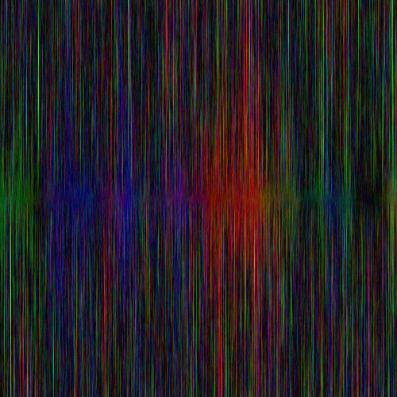
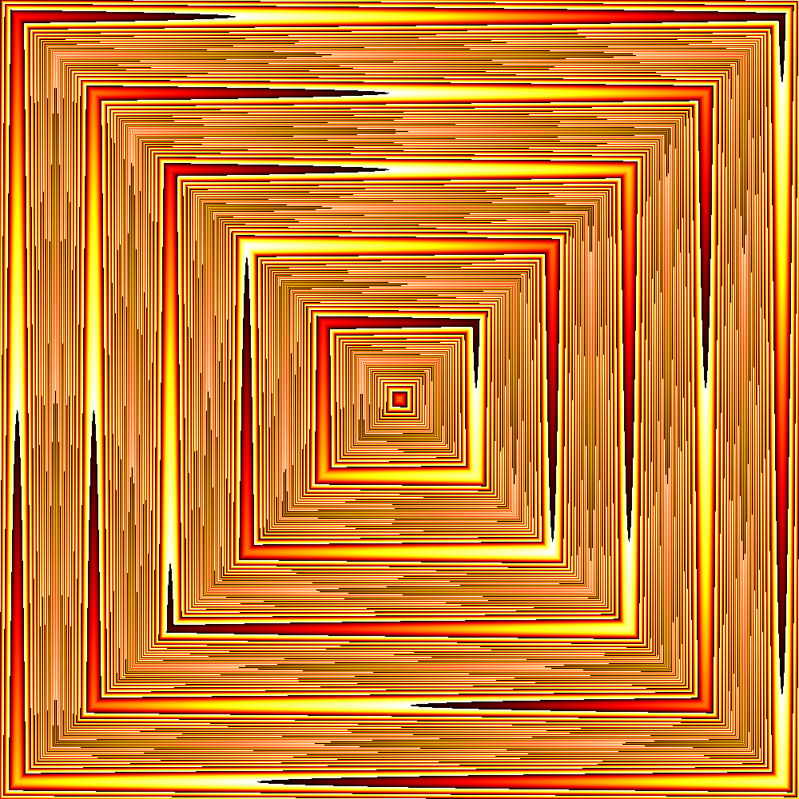
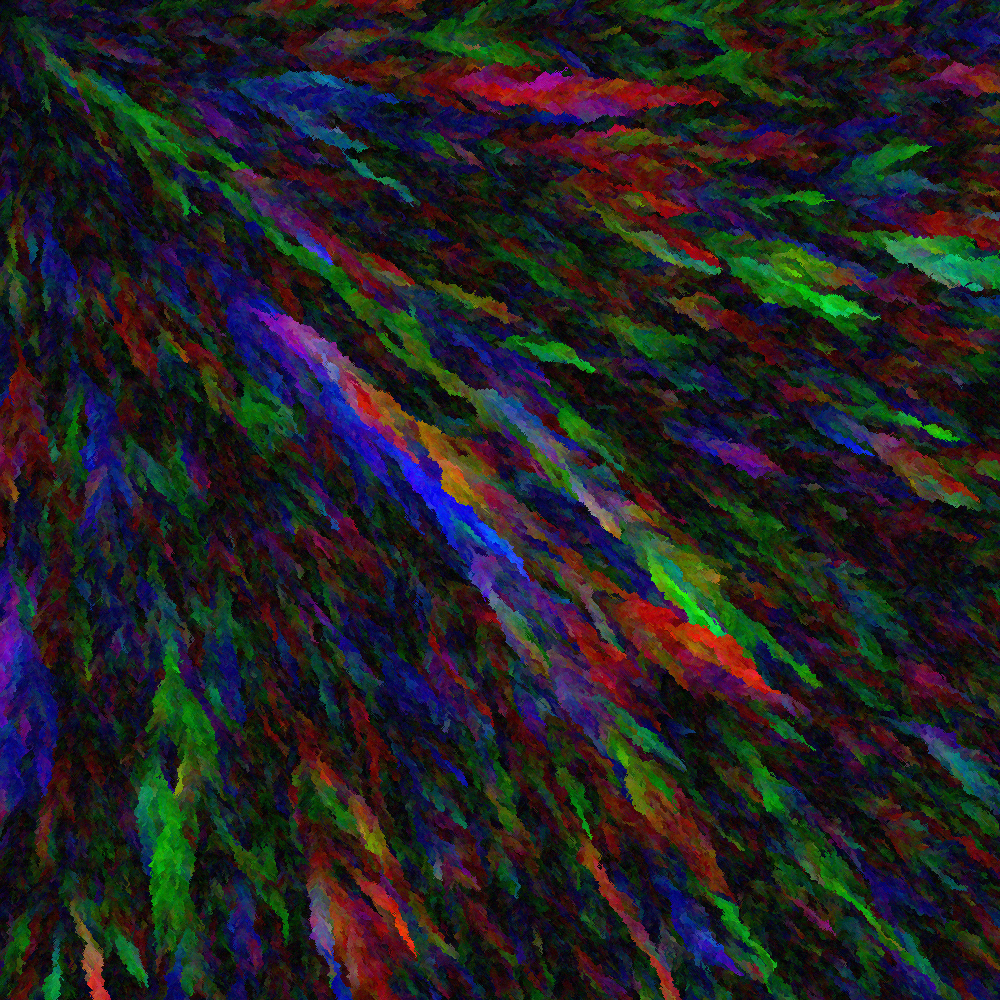
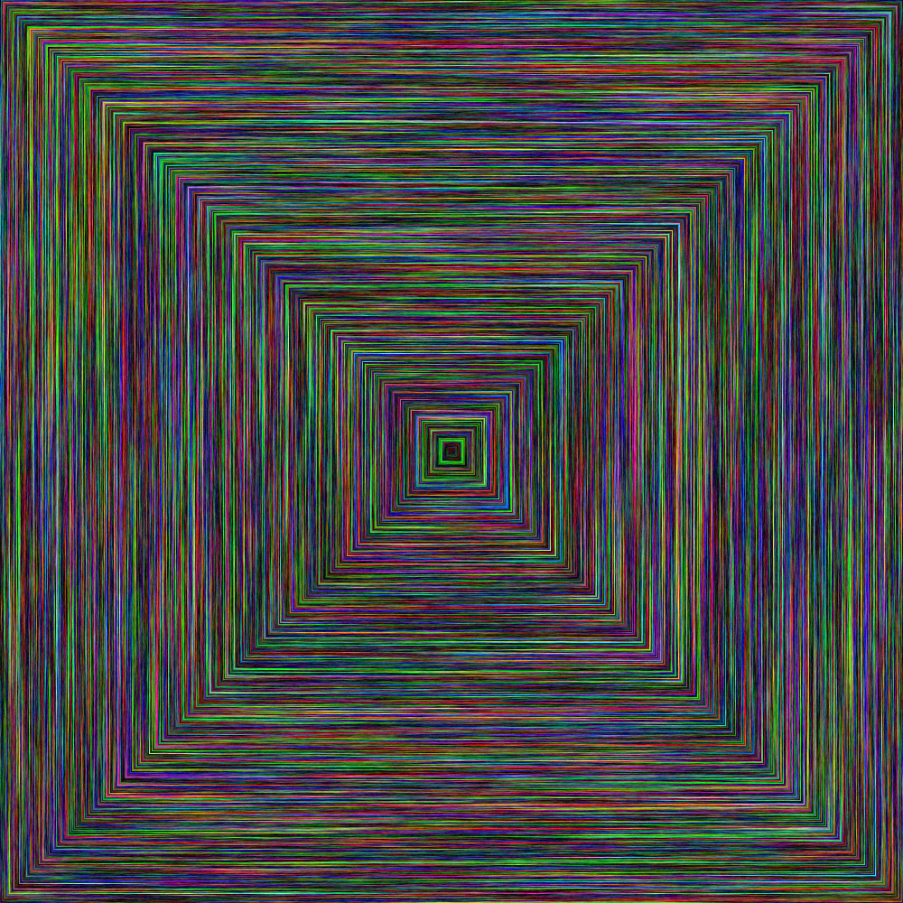
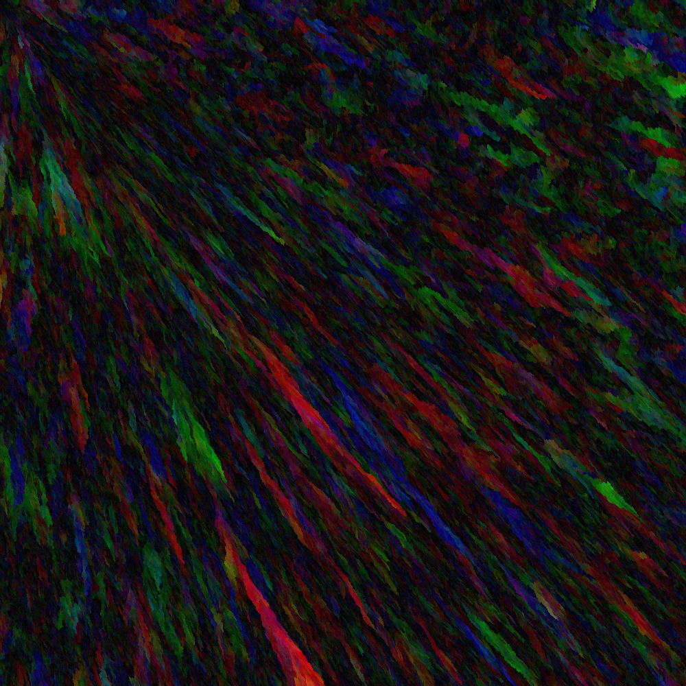
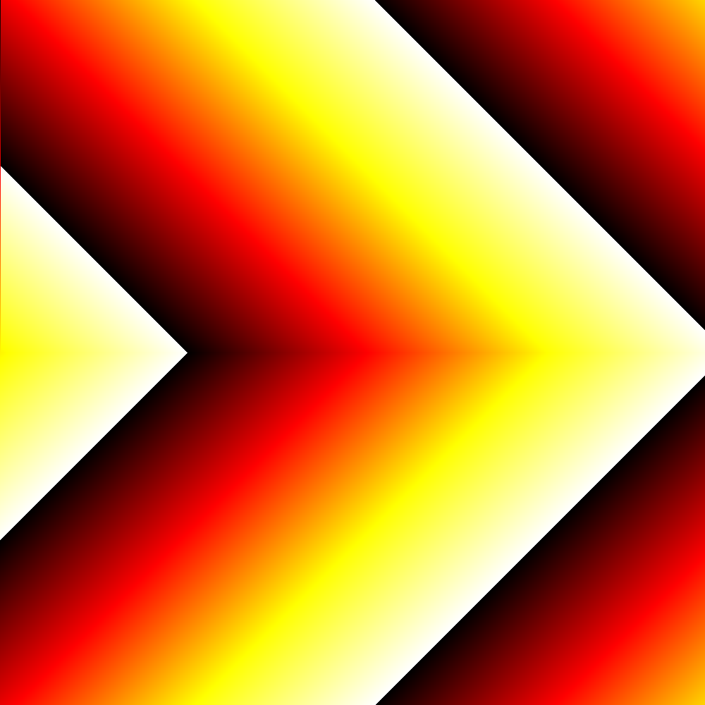

# fictures
This is a WIP command-line tool for generating images. `cargo run --release -- --help` should get you started for now.

## Some WIP output
`cargo run --release -- images/mirror.png -C rand -H 500 -W 500 -D 12 --seed 3`

`cargo run --release -- images/rumpelstiltskin.png -T spiral`

`cargo run --release -- images/flow.png -C rand -T prim -D 13 --seed 0`

`cargo run --release -- images/boxes.png -C rand -T spiral -D 15 --seed 0`

`cargo run --release -- images/warp.png -C rand -T prim -X 0.5 --seed 10`

`cargo run --release -- images/default-settings.png`

